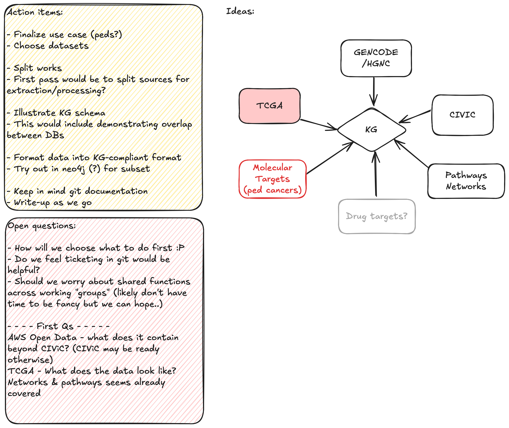

# Variant_Drug_KG
Build a knowledge graph connecting variants, drugs, and clinical evidence to identify therapeutic opportunities (e.g. CIViC - Clinical Interpretations of Variants in Cancer)

Analysis target: Pediatric cancers, which have historically been under-served, where drug companies were not previously required to study pediatric cancers. The FDA's Pediatric Molecular Target List is a list of genes that pediatric clinician experts have outlined as critical to address to treat pediatric cancer. The RACE for Children Act (USA) recently made it a rule that if an actionable mutation or gene is being targeted by pharma/biotech in an adult cancer, and if that target is in the PMTL,then the company must justify why they are not testing it or they must trial the drug in children.

Basing this project therefore on the Molecular Targets Project https://moleculartargets.ccdi.cancer.gov/  and the PMTL https://moleculartargets.ccdi.cancer.gov/fda-pmtl   

The Molecular Targets Project's data was produced with the OpenPedCan harmonization suite of tools https://github.com/d3b-center/OpenPedCan-analysis cited here: https://pubmed.ncbi.nlm.nih.gov/39026781/ 

Nodes: genes, diseases, drugs, pathway names etc.  Edges: relationships (with or w/out properties). 

Order of operations: Ingestion of GENCODE or HGNC, then CIVIC, then PMTL, then aggregated somatic variant data from Kids First/TARGET (as part of the molecular targets project, see above).  Also aggregated somatic variant data from TCGA if available (by cancer/cohort).

