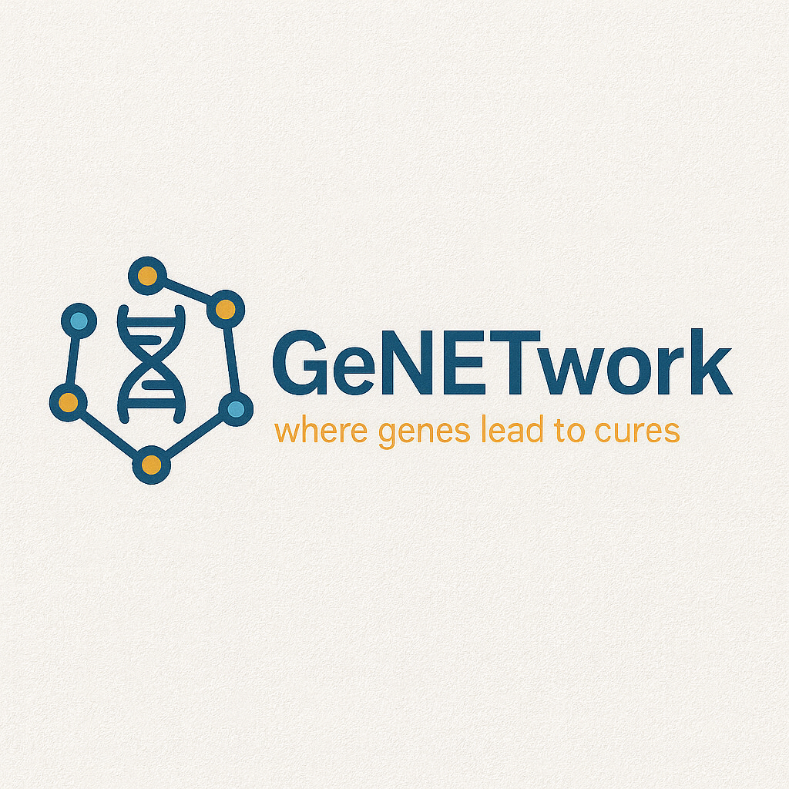
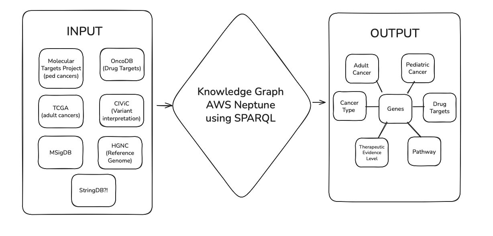

<p align="center">
  
</p>

## How to Install
**Clone the Repository**
```bash
git clone https://github.com/collaborativebioinformatics/Variant_Drug_KG.git
cd GeNETwork
```
**Get the Data**

The knowledge graph is still in development, but the raw data is available on **OSF**: [OSF Project Home](https://osf.io/ef2jw/?view_only=87fe279b56c348b294ff82413f324cd7)

**Requirements (Future Graph Development)**

Currently, no installation is required beyond accessing the datasets.
In the near future, we’ll include:
- Graph database setup (e.g., Amazon Neptune, Neo4j, or RDF tools)
- ETL scripts to ingest data into the graph
- Example queries (Gremlin / SPARQL / Cypher)

## Background
Pediatric cancers have historically been underserved in therapeutic development and clinical trials. Unlike adult cancers, they were not previously required to be studied by pharmaceutical companies, leaving most pediatric therapeutic discovery to pediatric researchers themselves. 

To address this gap, the FDA created the [Pediatric Molecular Target List (PMTL)](https://moleculartargets.ccdi.cancer.gov/fda-pmtl), a list of molecular targets important for studying and developing drugs for pediatric cancers. The [RACE for Children Act, USA]( https://www.congress.gov/bill/115th-congress/house-bill/1231) further strengthened this framework: if a drug company develops a therapy against an actionable mutation or gene in adult cancer, and that gene also appears on the PMTL, the company must either justify excluding pediatric trials or move forward with testing in children.

Building on this foundation, our project focuses on pediatric cancers using harmonized datasets from the [Molecular Targets Project (MTP)](https://moleculartargets.ccdi.cancer.gov/) which integrates genomic data from Kids First, TARGET, and other pediatric cohorts. This work was spearheaded at the Children's Hospital of Philadelphia, which aligned RNA and DNA sequencing data processed by the **Kids First Data Resource Center** and harmonized through the **OpenPedCan suite of tools** ([Github](https://github.com/d3b-center/OpenPedCan-analysis) cited in [Pubmed](https://pubmed.ncbi.nlm.nih.gov/39026781/)).

Together, these resources provide a robust and unified data foundation to explore pediatric-specific therapeutic opportunities that align with both clinical priorities (PMTL) and regulatory requirements (RACE Act).

# Methods

## Data Sources
|Source | Purpose | 
| :--: | :--: | 
| [Molecular Targets Project](https://moleculartargets.ccdi.cancer.gov) | Catalog of Molecular Targets |
| [FDA PMTL](https://moleculartargets.ccdi.cancer.gov/fda-pmtl) | Pediatric Cancer Target List |
| [TCGA](https://portal.gdc.cancer.gov) | Adult Cancer Somatic Mutations |
| [CIViC](https://civicdb.org/welcome) | Clinical variant interpretations |
| [OncoDB](https://oncodb.org) | Drug-target interactions |
| [MSigDB](https://www.gsea-msigdb.org/gsea/msigdb) | Pathway gene sets | 
| [HGNC](https://www.genenames.org) | Gene nomenclature standardization | 
| [StringDB](https://string-db.org) | Protein-protein interactions | 

## Flowchart 


## Knowledge Graph Schema


## Data Processing Pipeline
**Data Processing**

   - Downloaded datasets (TSV, JSON)
   - Standardized Schemas for each dataset from different sources using `gene_name` as primary key
   - Load to Open Science Framework (OSF)
    
**Knowledge Graph Construction**

  - Define Node types
  - Define relationships (edges)
  - Define properties
  - Load data on AWS Neptune

**Analysis & Querying**

  -  Use *SPARQL*
  - - Cross-age repurposing via shared variants
    - Pathway-level repurposing
    - TCGA-specific insights
    - Drug-Repurposing Opportunities
    - Variants in Both Adult and Pediatric Cancers
    - Co-mutation Analysis
    - Therapeutic Gaps
    - Paths from Variant to Drug
   
**Visualization/Outputs**

  - Network/ Graph Visualizations
  - Downloadable Summary Tables
