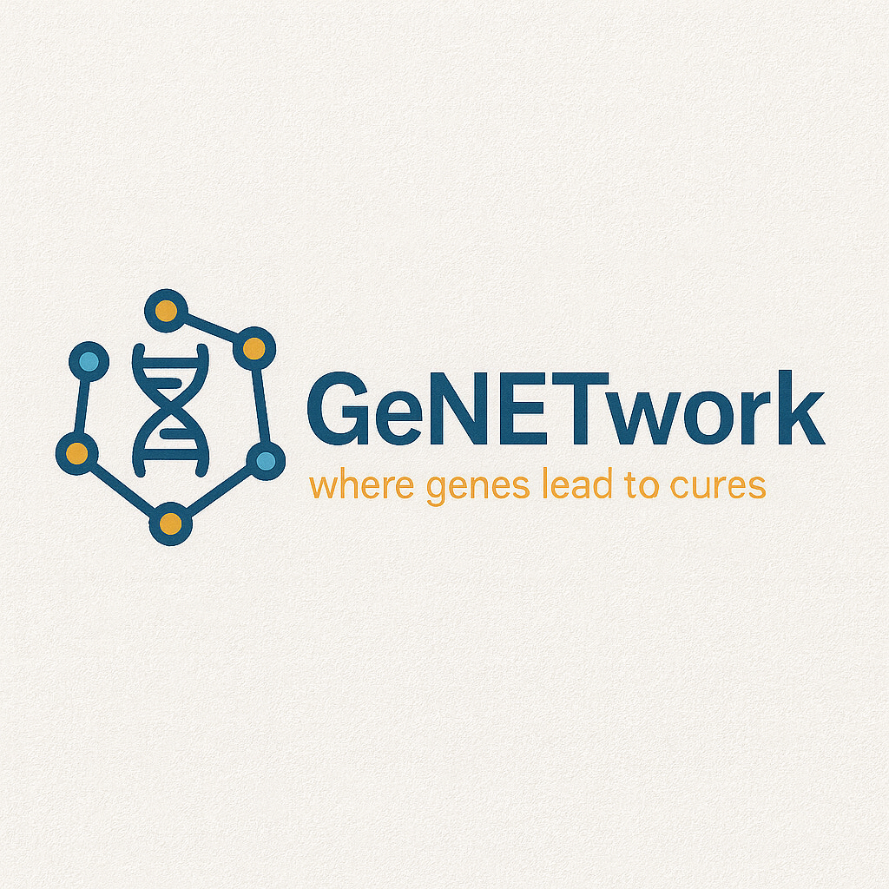
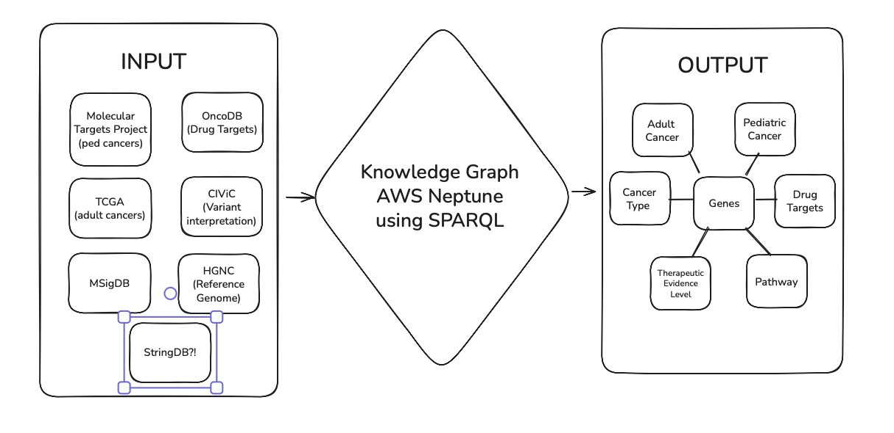
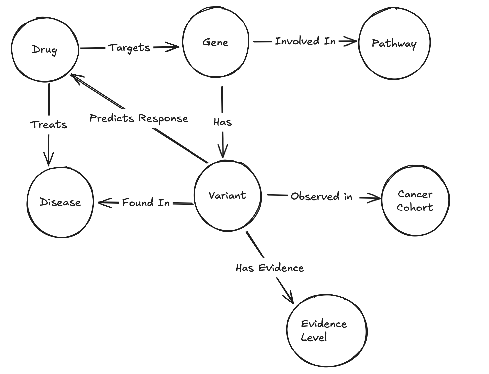

<p align="center">
  
</p>

## How to Install
**Clone the Repository**
```bash
git clone https://github.com/YourOrg/GeNETwork.git
cd GeNETwork
```
**Get the Data**

The knowledge graph is still in development, but the raw data is available on **OSF**: [OSF Project Home](https://osf.io/ef2jw/?view_only=87fe279b56c348b294ff82413f324cd7)

**Requirements (Future Graph Development)**
Currently, no installation is required beyond accessing the datasets.
In the near future, we’ll include:
- Graph database setup (e.g., Amazon Neptune, Neo4j, or RDF tools)
- ETL scripts to ingest data into the graph
- Example queries (Gremlin / SPARQL / Cypher)
___

## Background
Analysis target: Pediatric cancers, which have historically been underserved in terms of therapeutic development and clinical trials, as drug companies were not previously required to study pediatric cancers. Most pediatric therapeutic discovery is done by pediatrics researchers, not drug companies.    The FDA's Pediatric Molecular Target List is a list of genes that pediatric clinician experts have outlined as critical to address to treat pediatric cancer. The RACE for Children Act (USA, https://www.congress.gov/bill/115th-congress/house-bill/1231) recently made it a rule that if an actionable mutation or gene for an adult cancer is being targeted by pharma/biotech, and if that target is in the PMTL,then the company must justify why they are not testing it or they must trial the drug in children.

Basing this project therefore on pediatric cancers, where the data has been harmonized for the Molecular Targets Project (MTP: https://moleculartargets.ccdi.cancer.gov/)  and the FDA PMTL https://moleculartargets.ccdi.cancer.gov/fda-pmtl

The Molecular Targets Project's data was produced at the Children's Hospital of Philadelphia with aligned RNA and DNA sequence data by the Kids First Data Resource Center from Kids First, TARGET and other pediatric cancer datasets.  The data was all harmonized with the OpenPedCan  suite of tools https://github.com/d3b-center/OpenPedCan-analysis cited here: https://pubmed.ncbi.nlm.nih.gov/39026781/ and used in the MTP website.

Nodes for this KG: genes, diseases, drugs, pathway names etc.  Edges: relationships. 

Order of operations: Ingestion of GENCODE or HGNC, then CIVIC, then PMTL, then aggregated somatic variant data from Kids First/TARGET (as part of the molecular targets project, see above).  Also aggregated somatic variant data from TCGA if available (by cancer/cohort).
___ 
## Overview
We call this ATLAS_KG: the Actionable Therapeutics Linkage for Age-Stratified cancers Knowledge Graph. Like a geographic atlas helps you navigate terrain, ATLAS_KG helps navigate the landscape of therapeutic opportunities connecting adult and pediatric cancer precision medicine.

---

# Methods
This project builds a knowledge graph integrating pediatric and adult cancer data to answer multiple queries including identifying repurposing opportunities mandated by the RACE for Children Act. 

## Data Sources
|Source | Purpose | Access |
| :--: | :--: | :--: |
| Molecular Targets Project | Pediatric Molecular targets and PMTL | [Link](https://moleculartargets.ccdi.cancer.gov)
| TCGA | Adult Cancer Somatic Mutations | |
| CIViC | Clinical variant interpretations | [Link](https://civicdb.org/welcome) |
| OncoDB | Drug-target interactions | |
| MSigDB | Pathway gene sets | | 
| HGNC | Gene nomenclature standardization | |
| StringDB | Protein-protein interactions | |

## Flowchart 
Live version of the below image is at https://excalidraw.com/#room=84a47bb70689327cd820,B6WRlwllBajvdws7goQYjg


## Knowledge Graph Schema


## Data Processing Pipeline
1. Data Acquisition (OSF/S3??)
2. Preprocessing: StringDB will be 
4. Graph Construction: Data transformed to triples and loaded into AWS Neptune. StringDB will be added to ensure network connectivity. 
5. Quality Control

